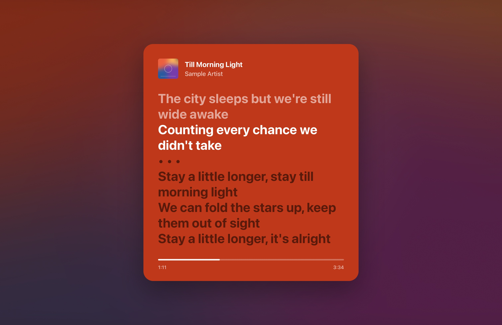
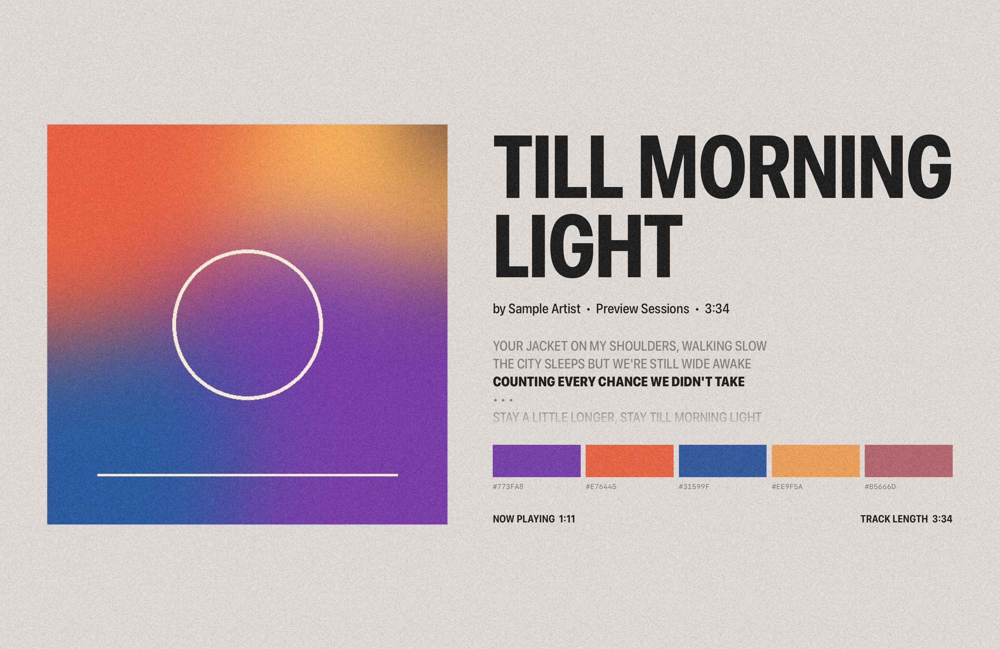
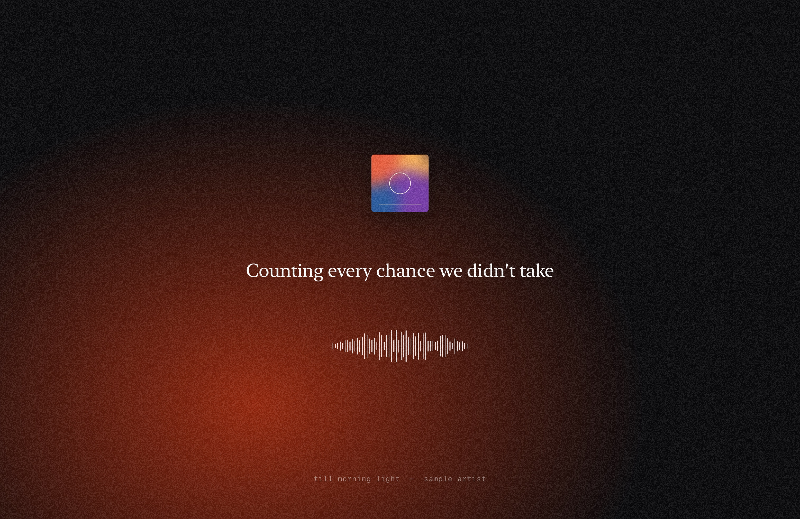
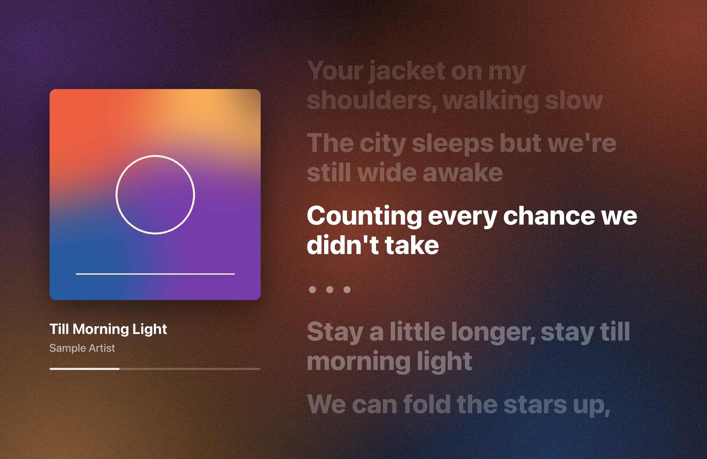
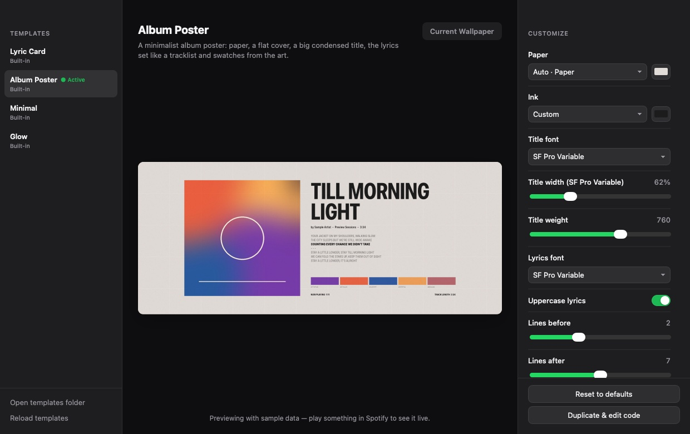

# Spotify Wallpaper

A macOS menu bar app that turns your desktop into whatever Spotify is playing: the cover art plus **live, synced
lyrics** that animate line by line, on every Space and every monitor. Designs are HTML/CSS templates you can tweak
with sliders or rewrite completely.

<p align="center">
  
  
  
  
</p>

## Features

- **Synced lyrics from four sources:** [LRCLIB](https://lrclib.net), NetEase Cloud Music, QQ Music and Kugou, searched
  in parallel. The app matches lines across sources and uses the **median timestamp** for each one, so a single
  badly timed source gets outvoted, and a source synced to a different version of the song is dropped. Each line
  changes on its exact timestamp, with optional karaoke-style fill.
- **Animated:** lyrics scroll and rise in, the waveform moves, gradients drift. You can cap the frame rate to save battery.
- **Every Space, every monitor.** Each display gets a frame drawn at its own size and aspect ratio (laptop and ultrawide).
- **The real wallpaper stays in sync.** On every track change the app also sets your actual wallpaper to a still of
  the song, so the lock screen and Mission Control match. When you quit, or nothing is playing, your own wallpaper
  comes back.
- **Four built-in templates** based on popular Pinterest styles: Lyric Card (Spotify lyric cards), Album Poster
  (minimalist album posters with color swatches), Minimal (small type on a grainy gradient) and Glow (Apple Music
  style full-screen lyrics).
- **Colors from the cover:** every template can follow each song's palette automatically.
- **Customizable:** each template's settings (colors, fonts, sizes, lines shown, blur, grain, animation) appear in
  the Customize window with a live preview. You can also duplicate a template and edit its HTML/CSS directly; it
  reloads as you save.
- **No login or API key.** It reads the Spotify desktop app directly.

<p align="center"></p>

## Install

1. Download **Spotify-Wallpaper-x.y.zip** from the [latest release](../../releases/latest) and unzip it.
2. Move **Spotify Wallpaper.app** to **/Applications**.
3. The app isn't notarized by Apple, so the first time, **right-click it → Open → Open**. Or run:
   ```sh
   xattr -dr com.apple.quarantine "/Applications/Spotify Wallpaper.app"
   ```
4. When macOS asks whether Spotify Wallpaper may **control Spotify**, click **OK**. That's how it reads what's playing.

Requires macOS 14 Sonoma or later and the Spotify desktop app. It runs natively on Apple Silicon and Intel.

**Recommended:** turn on **System Settings → Wallpaper → Show on all Spaces**, so the still wallpaper is shared by
every Space rather than set one Space at a time.

## Use

Everything is in the ♪ menu bar icon:

| Menu item | What it does |
|---|---|
| **Template** | Switch between templates |
| **Customize… (⌘,)** | Gallery, live preview and every setting of each template |
| **Lyrics** | Which sources were used, or pick one source. Nudge timing earlier or later (remembered per song), or search again |
| **Refresh Rate** | Display maximum, 60, 30 or 15 fps for the animation. Lyric timing is exact at any rate |
| **Pause Wallpaper** | Put your normal wallpaper back until you resume |
| **Open Templates Folder** | Where your own templates live |
| **Launch at Login** | Start automatically |

## Make your own templates

A template is a folder with a `manifest.json` (name and settings) and an `index.html`. The quickest start is
**Customize → pick a template → Duplicate & edit code**. That copies it to
`~/Library/Application Support/Spotify Wallpaper/Templates/`, and the preview and desktop reload every time you save.

```html
<!doctype html>
<html><head>
<meta charset="utf-8">
<link rel="stylesheet" href="/runtime/runtime.css">
<script src="/runtime/runtime.js"></script>
<style>
  body { background: var(--dark); color: #fff; font-family: var(--param-font); }
  lyrics-block .current { font-size: 6vmin; font-weight: 800; }
  lyrics-block .next { opacity: calc(0.5 - var(--dist) * 0.1); }
</style>
</head><body>
  
  <h1 data-bind="track.title|upper"></h1>
  <lyrics-block class="karaoke" layout="center" before="1" after="3"></lyrics-block>
</body></html>
```

Settings declared in `manifest.json` show up as controls automatically:

```json
{
  "name": "My Template",
  "params": [
    { "key": "font", "type": "font", "label": "Font", "default": "New York" },
    { "key": "accent", "type": "color", "label": "Accent", "default": "auto:vibrant" }
  ]
}
```

You get track data (`track.title`, `track.progress`, …), lyrics (`lyrics.current`, `lyrics.next1`,
`lyrics.lineProgress`, …), cover colors (`--vibrant`, `--dominant`, `--p0`…`--p5`, …), smart components
(`<lyrics-block>`, `<fit-text>`, `<swatch-row>`, `<wave-form>`, `<progress-bar>`) and animation hooks. The full
reference is in **[TEMPLATE_GUIDE.md](app/Resources/web/TEMPLATE_GUIDE.md)**, which is also copied into your
templates folder.

## How it works

```
Spotify app ──AppleScript, every 0.1s──▶ Engine ──▶ lyrics: LRCLIB + NetEase + QQ Music + Kugou → consensus timing
                                           │         cover art → colors via k-means
                                           │
                     ┌─────────────────────┴──────────────────────┐
                     ▼                                            ▼
   Live layer (per screen)                          Still (per screen, on track change)
   WKWebView in a window just above the             same template rendered off-screen, snapshotted
   wallpaper and below the desktop icons,           and set as the real wallpaper via NSWorkspace
   on all Spaces. The template runs its own
   playback clock, re-synced every 0.1s, so
   lines change on their exact timestamps.
```

- Lyrics: each source is searched with the track's title, artist and duration, and results must match all three.
  Lines from the synced sources are aligned by text similarity. The best-edited source that agrees with the rest
  provides the text, and every line gets the median time across sources. Sources sharing a catalogue (QQ Music and
  Kugou) count once. Results are cached per song.
- Templates are served from a private `sw://` URL scheme, so they load the shared runtime, the cover and system
  fonts without any local server.
- macOS only sets the wallpaper of the current Space, so the still is re-applied when you switch Spaces. With
  "Show on all Spaces" on, it applies to all of them at once. Each screen alternates between two files, because
  macOS caches wallpapers by path.
- Your original wallpaper is remembered and restored on quit, on pause and when Spotify stops.

## Build from source

Needs Xcode 15+ (Swift 5.9).

```sh
cd app
./build.sh            # build into app/build/
./build.sh install    # build, copy to /Applications and launch
./build.sh release    # universal build + zip for a release
```

See what every lyrics source returns for a song, and the combined timing:

```sh
"app/build/Spotify Wallpaper.app/Contents/MacOS/SpotifyWallpaper" --lyrics "Blinding Lights" "The Weeknd" "After Hours" 200
```

README screenshots are generated with the bundled sample song:

```sh
"app/build/Spotify Wallpaper.app/Contents/MacOS/SpotifyWallpaper" --screenshots docs/screenshots
```

`prototype/` holds the original Python proof of concept, which drew frames with Pillow. It's kept for reference and
isn't needed by the app.

## Privacy

The app only talks to the Spotify app on your Mac, the lyrics sources (`lrclib.net`, `music.163.com`, `y.qq.com`,
`lyrics.kugou.com`, which receive the song's title, artist, album and duration) and Spotify's image CDN (to
download the cover). Lyric requests are sent without cookies. Nothing else leaves your machine.

## Credits

- Lyrics: [LRCLIB](https://lrclib.net) (a free, open lyrics database), NetEase Cloud Music, QQ Music and Kugou.
- Design inspiration: Spotify lyric cards, minimalist album posters and lyric wallpapers on Pinterest.

Not affiliated with or endorsed by Spotify. Spotify is a trademark of Spotify AB.

## License

[MIT](LICENSE)
